# PlugPorch - Peer-to-Peer EV Charging Marketplace

[](https://nodejs.org/)
[](https://reactnative.dev/)
[](https://www.mongodb.com/)
[](https://socket.io/)
[](https://stripe.com/)

<div align="center" style="display: flex; justify-content: center; gap: 10px; flex-wrap: nowrap;">
  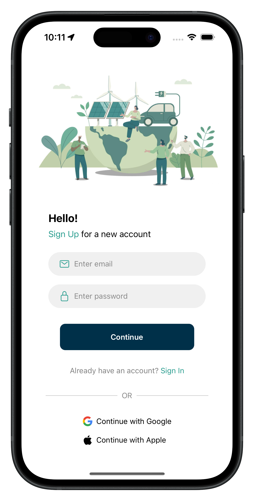
  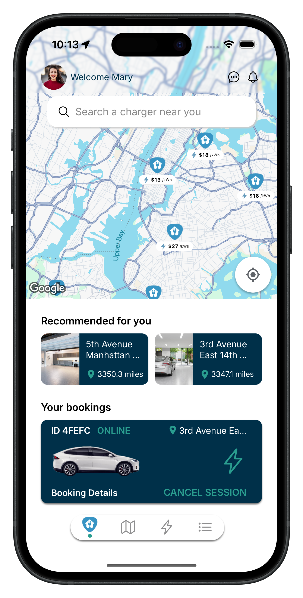
  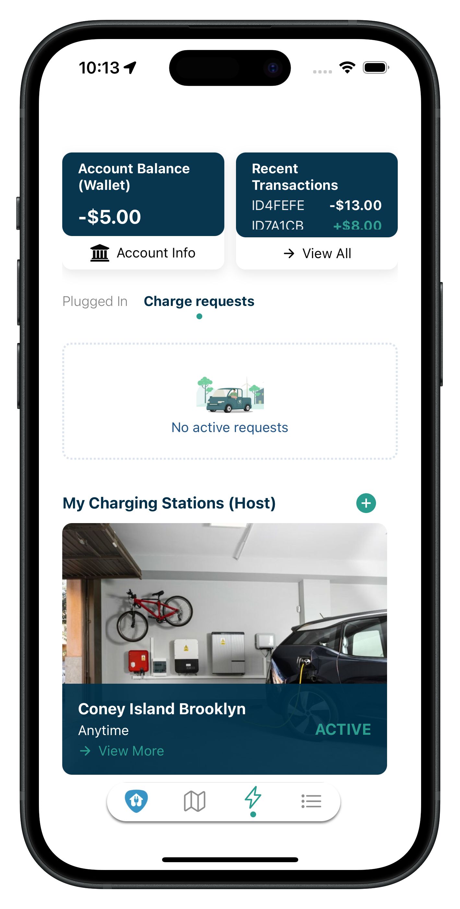
</div>

## 📋 Table of Contents

- [Overview](#-overview)
- [Team](#-team)
- [Features](#-features)
- [Architecture](#-architecture)
- [Tech Stack](#-tech-stack)
- [Installation](#-installation)
- [Database Schema](#-database-schema)
- [License](#-license)

## 🏠 Overview

**PlugPorch** is the "Airbnb for EV charging." We address the critical limitation of public charging infrastructure by connecting EV owners with homeowners who have private chargers. Our platform transforms private driveways into a shared, rentable network, helping drivers eliminate range anxiety while allowing hosts to monetize their home infrastructure.

<div align="center">
  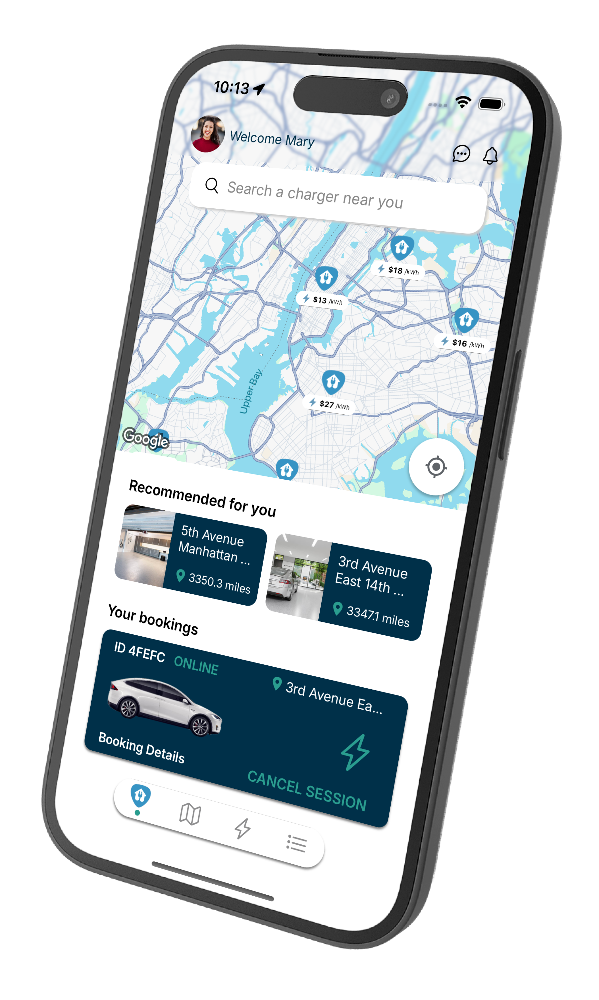
  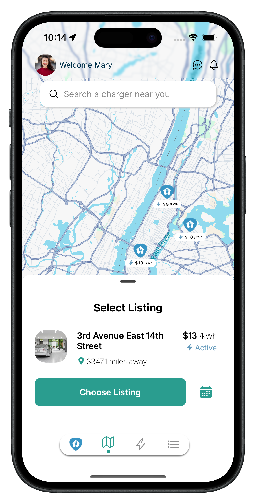
</div>

### The Problem

EV owners are often restricted to commercial chargers which may be unavailable, broken, or non-existent in certain residential areas, leaving drivers stranded.

### The Solution

An intuitive mobile marketplace where individuals can rent out their home chargers. Drivers find a plug, book a slot, and pay—all through a single app.

## 👥 Team Members

- **John Suli** – xsuli@seas.upenn.edu
- **Jia Wu** – jiaywu@seas.upenn.edu
- **Thien Tong** – thient@seas.upenn.edu
- **Vincent Luu** – luuvince@seas.upenn.edu

## ✨ Features

### 🎯 Core Capabilities

#### 🗺️ Interactive Map

Real-time Google Maps integration showing nearby residential chargers.

<div align="center">
  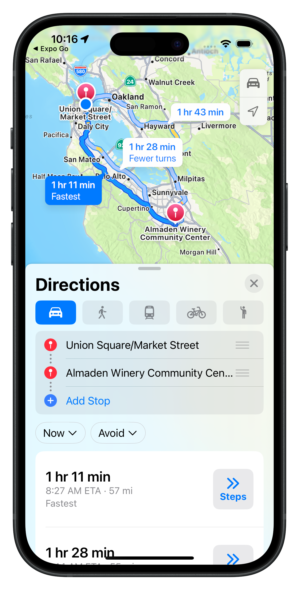
  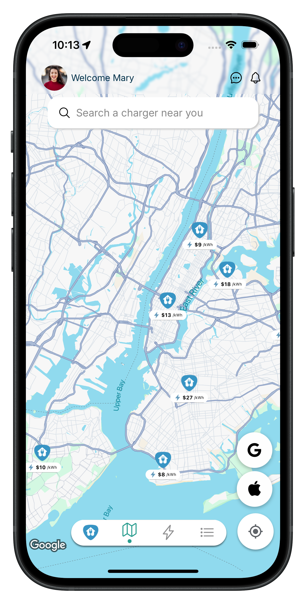
</div>

#### 🔐 Smart Onboarding

Fast, secure user authentication via Clerk with seamless sign-up and verification.

<div align="center">
  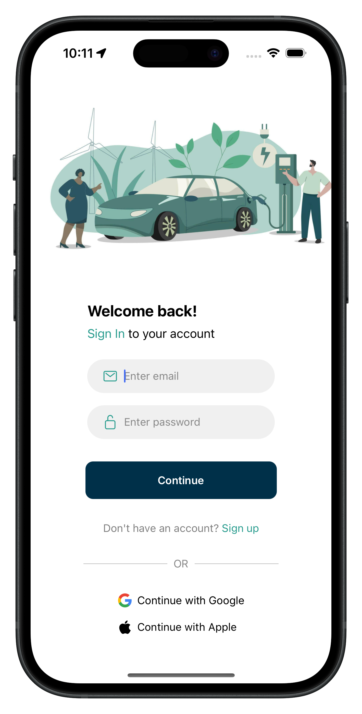
  
  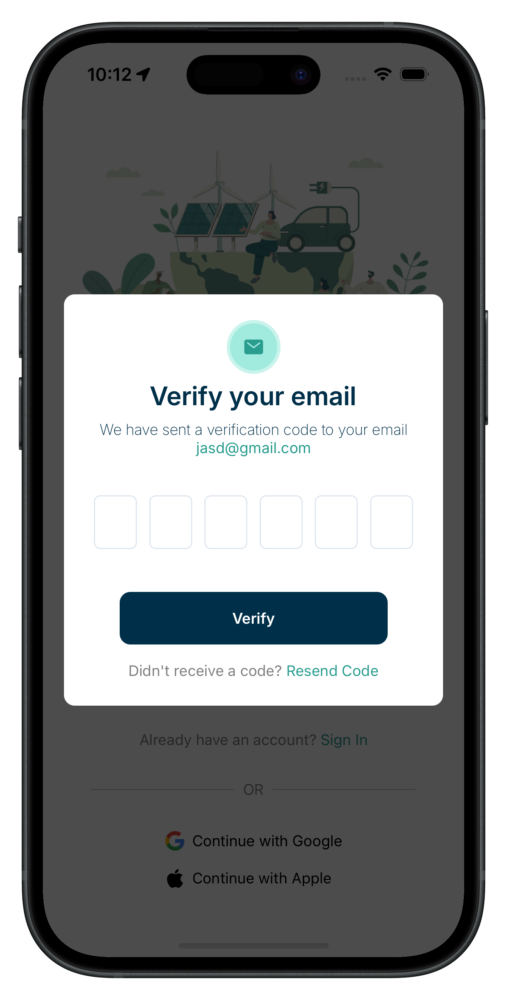
</div>

#### 📱 Onboarding Experience

Guided introduction to help users understand the platform.

<div align="center">
  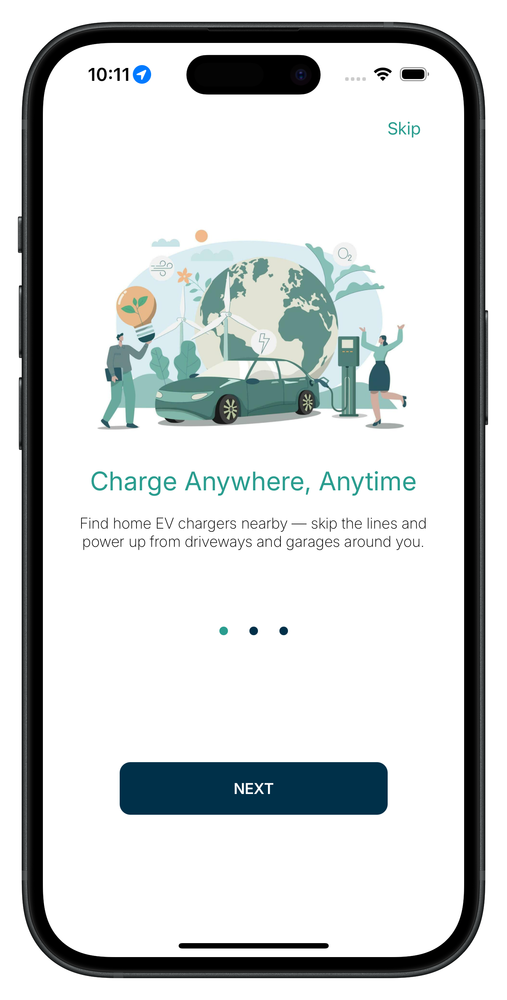
  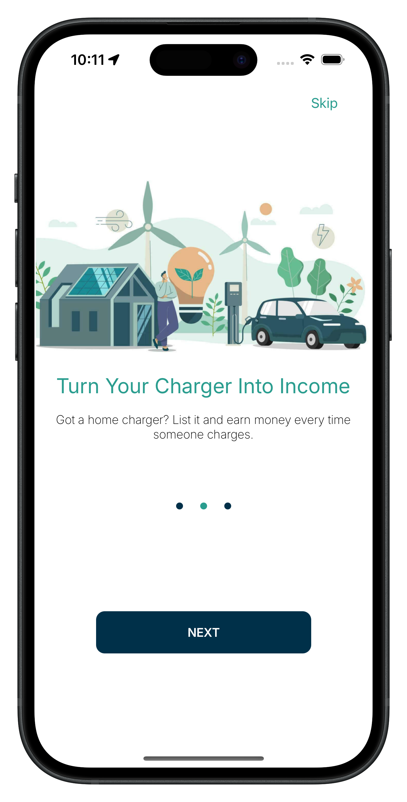
  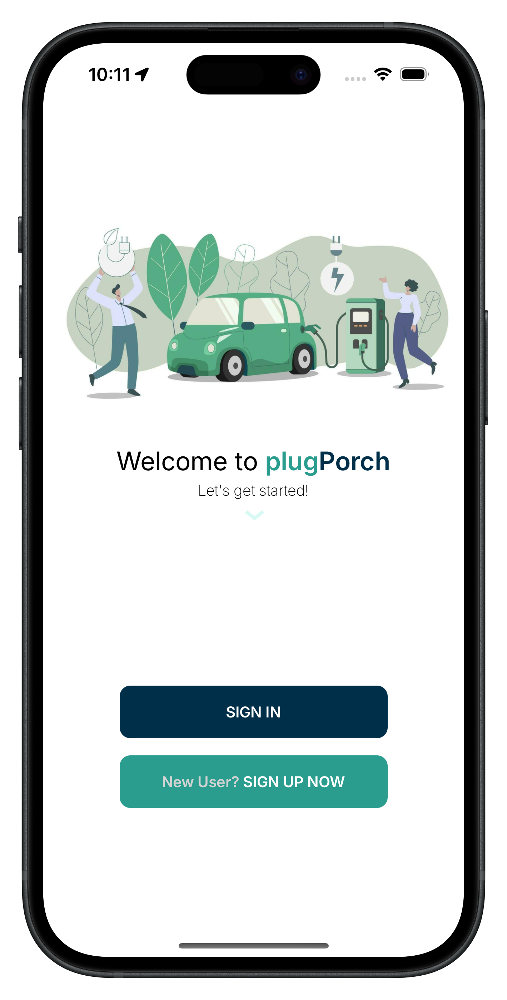
</div>

#### 📋 Listings & Discovery

Browse all available charging stations with detailed information.

<div align="center">
  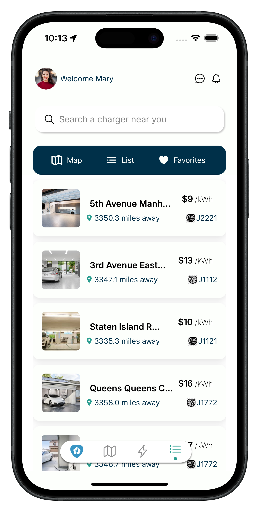
</div>

#### 🏠 Host Dashboard

Manage your charging station listings and bookings.

<div align="center">
  
</div>

#### 💳 Secure Payments

Automated invoicing and secure transactions via Stripe.

<div align="center">
  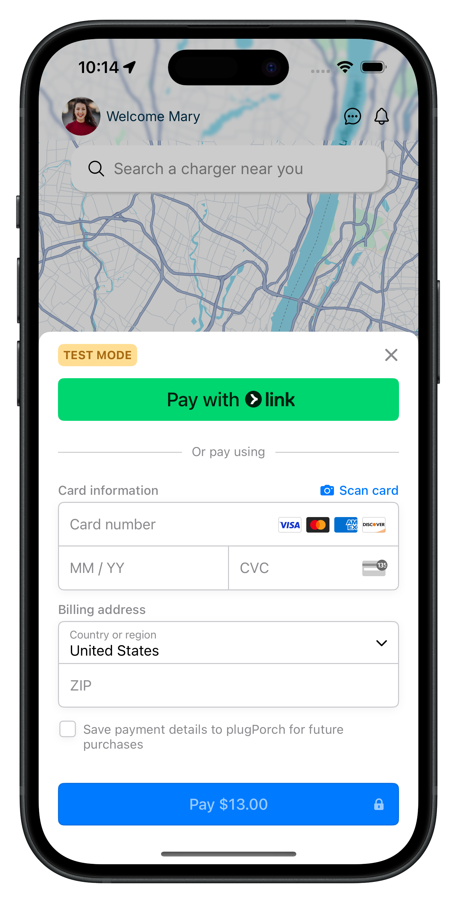
</div>

#### 👤 User Profile

Seamlessly switch between being a Driver (renter) and a Host (owner).

<div align="center">
  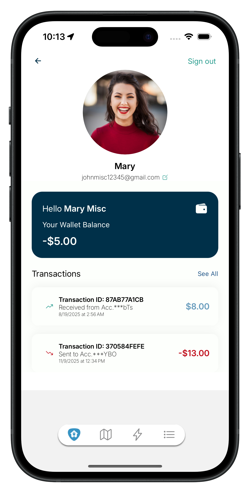
</div>

#### 💬 Real-Time Messaging

In-app chat powered by Socket.io for coordinating charger access.

<div align="center">
  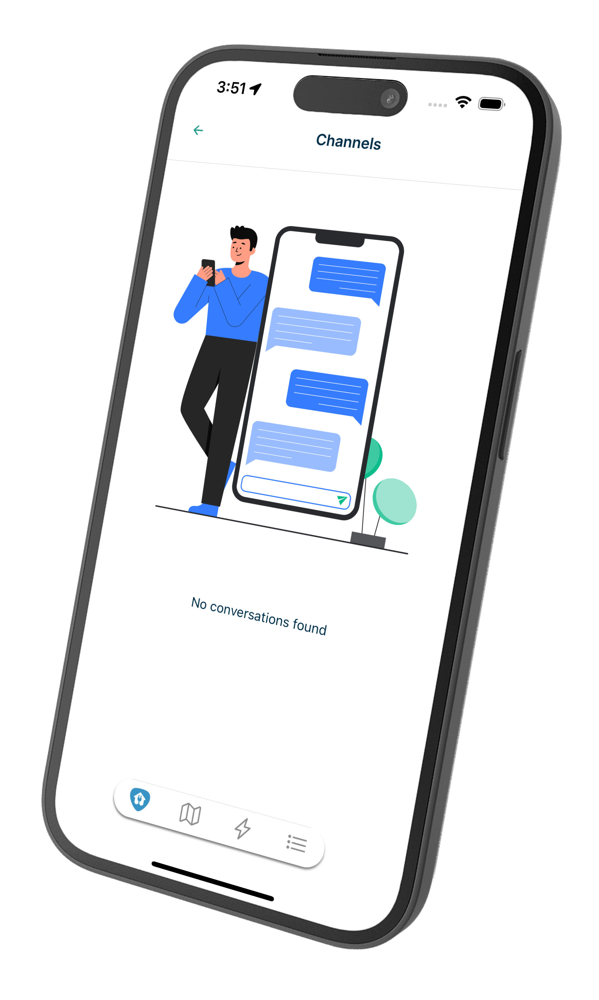
  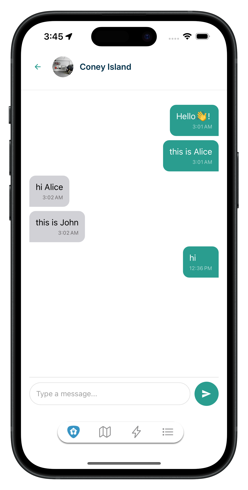
</div>

#### 🔔 Booking Management

Real-time notifications for booking requests, approvals, and status updates.

<div align="center">
  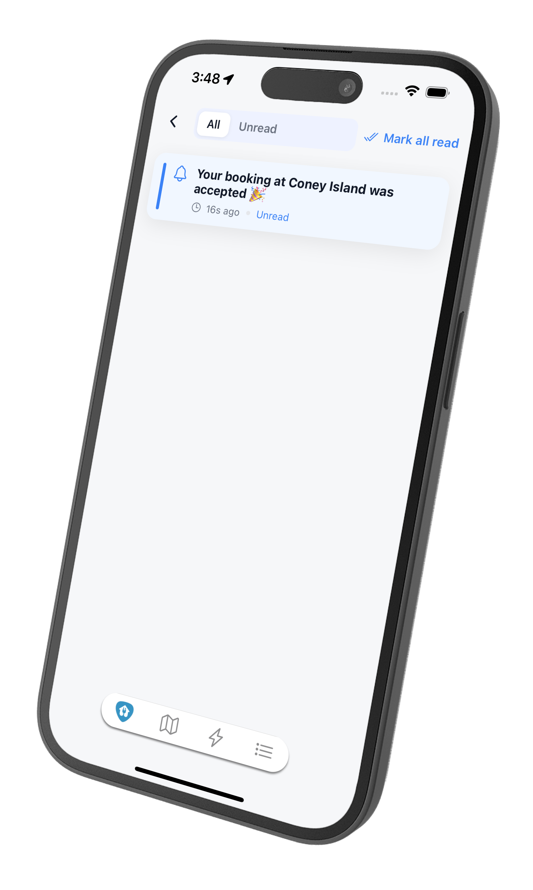
  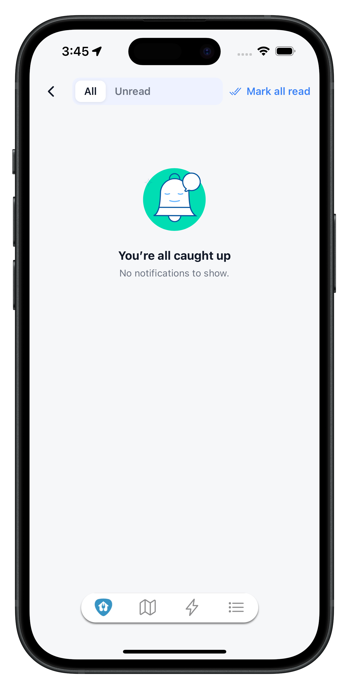
</div>

## 🏗 Architecture

### System Overview

PlugPorch utilizes a modern **mobile-first architecture** designed for real-time interaction and secure financial transactions.

```
┌─────────────────┐
│  Mobile App     │  React Native (Expo)
│  (iOS/Android)  │
└────────┬────────┘
         │
         ├─────────────────────────────────┐
         │                                 │
┌────────▼────────┐              ┌─────────▼─────────┐
│  Backend API    │              │  Real-Time Layer   │
│  Node.js/Express│              │     Socket.io      │
└────────┬────────┘              └────────────────────┘
         │
┌────────▼────────┐
│   Database      │
│    MongoDB      │
└─────────────────┘
```

### Component Breakdown

- **📱 Frontend Layer**: React Native (Expo) provides a native experience for both iOS and Android with real-time map integration
- **⚙️ Backend Layer**: Node.js/Express handles business logic, booking states, and payment orchestration
- **⚡ Real-Time Layer**: Socket.io maintains persistent WebSocket connections for instant messaging and notifications
- **💾 Data Layer**: MongoDB stores flexible document-based data for users, listings, bookings, and chat histories

## 🛠 Tech Stack

### Frontend

- **Framework**: React Native with Expo
- **Maps**: Google Maps SDK
- **Styling**: Tailwind CSS (NativeWind)
- **State Management**: React Query / Context API

### Backend

- **Runtime**: Node.js
- **Framework**: Express.js
- **Real-Time**: Socket.io
- **Database**: MongoDB with Mongoose ODM

### Services

- **Authentication**: Clerk
- **Payments**: Stripe API

## 📋 Prerequisites

Before you begin, ensure you have the following installed and configured:

- **Node.js**: v18.0.0 or higher ([Download](https://nodejs.org/))
- **npm** or **yarn**: Package manager
- **Expo CLI**: Install globally with `npm install -g expo-cli`
- **MongoDB**: A running instance (Local or [MongoDB Atlas](https://www.mongodb.com/cloud/atlas))
- **Expo Go**: Installed on your mobile device for testing ([iOS](https://apps.apple.com/app/expo-go/id982107779) | [Android](https://play.google.com/store/apps/details?id=host.exp.exponent))
- **API Keys**:
  - [Clerk](https://clerk.com/) - Authentication
  - [Stripe](https://stripe.com/) - Payment processing
  - [Google Maps](https://developers.google.com/maps) - Map integration

## 🚀 Installation

### 1. Clone the Repository

```bash
git clone https://github.com/your-repo/plugporch.git
cd plugporch
```

### 2. Install Dependencies

```bash
# Install backend dependencies
cd backend
npm install

# Install mobile app dependencies
cd ../mobile
npm install
```

### 3. Configure Environment Variables

Create a `.env` file in the `backend` directory with the following variables:

```env
PORT=3000
MONGODB_URI=your_mongodb_connection_string
STRIPE_SECRET_KEY=your_stripe_secret_key
CLERK_API_KEY=your_clerk_api_key
GOOGLE_MAPS_API_KEY=your_google_maps_api_key
```

### 4. Run the Application

Open two terminal windows:

**Terminal 1 - Backend Server:**

```bash
cd backend
npm run dev
```

**Terminal 2 - Mobile App:**

```bash
cd mobile
npx expo start
```

Scan the QR code with Expo Go (iOS) or the Expo app (Android) to run the app on your device.

## 📊 Database Schema

> 💡 **Visual Reference**: You can view the interactive Entity Relationship Diagram [here](mobile/assets/readme/erd.png)

PlugPorch uses a **document-oriented approach** to handle the dynamic nature of peer-to-peer rentals:

### 📦 Core Collections

- **👤 Users**

  - Identity information
  - Vehicle type preferences
  - Host/driver role settings

- **📍 Listings**

  - Geographic location data
  - Charger type (Level 2/NACS)
  - Hourly rate configuration
  - Availability schedules

- **📅 Bookings**

  - Transaction status tracking
  - Time slot reservations
  - Relational links between driver and host

- **💬 Messages**

  - Chronological chat history
  - Indexed by booking ID
  - Real-time conversation threads

- **💳 Payments**

  - Transaction records
  - Stripe invoice references
  - Payment status and history

## 📄 License

This project is licensed under the MIT License - see the [LICENSE](LICENSE) file for details.
